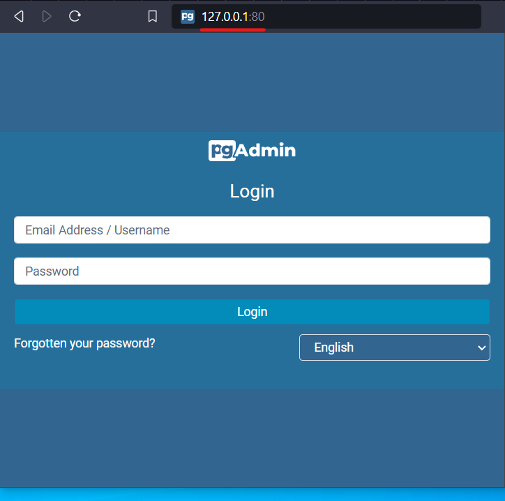
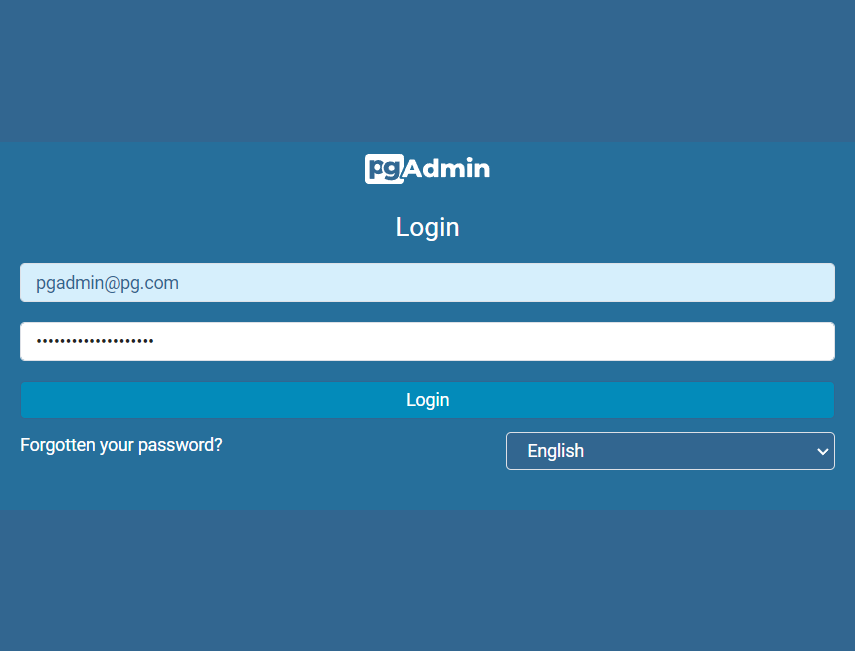
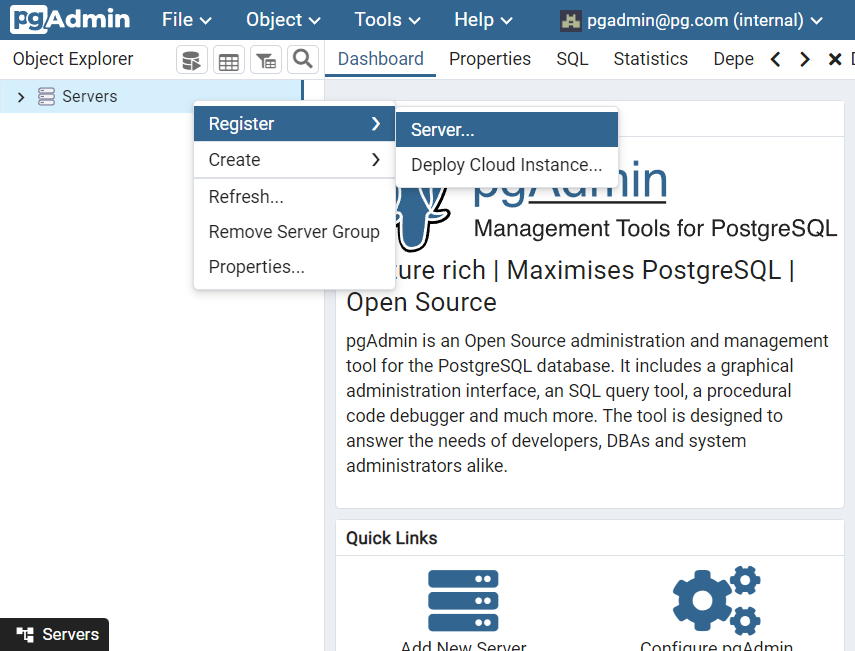
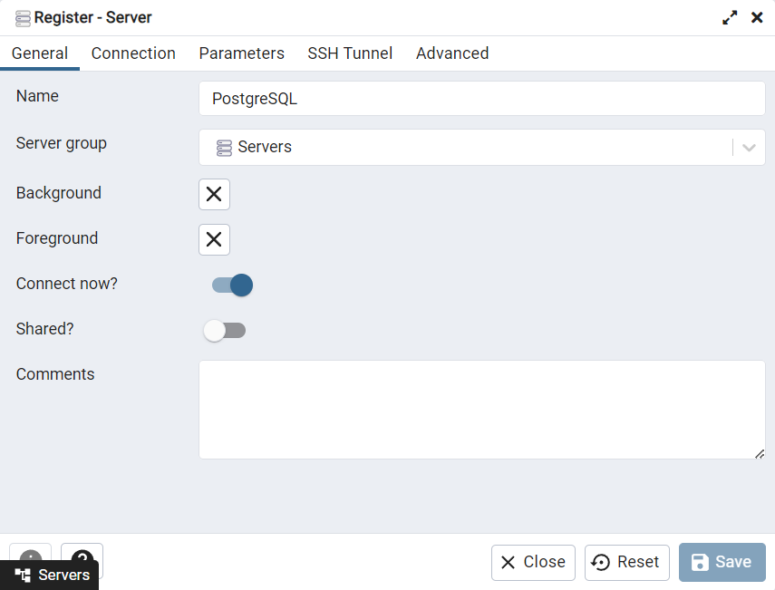
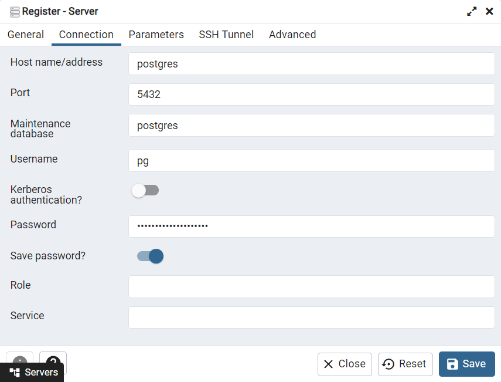

 

# 📰 Guide

### 1. Make sure you have Git and Docker installed by running the following commands:

```bash
$ git -v
```

```bash
$ docker -v
```

### 2. Clone the repository and move to the project directory:

```bash
$ git clone https://github.com/PJuanCruz/postgresql-pgadmin4-container.git
```

```bash
$ cd postgresql-pgadmin4-container
```

### 3. Start the Docker container:

```bash
docker compose up -d
```

### 4. Connect PgAdmin4:

- [127.0.0.1:[PGADMIN_PORT]](http://127.0.0.1/)



- Email Address / Username: [PGADMIN_EMAIL]

- Password: [PGADMIN_PASSWORD]





- Name: PostgreSQL



- Host name/address: [Service Name]

- Port: [PG_PORT]

- Maitenance database: [PG_DATABASE]

- Username: [PG_USER]

- Password: [PG_PASSWORD]



### 5. Stop and remove containers and networks:

```bash
docker compose down
```
